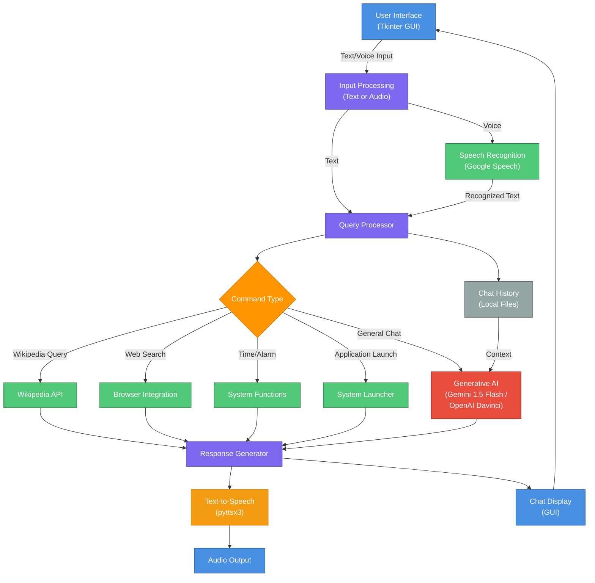

# Windows Assistant

An early-stage conversational AI assistant for Windows with integrated voice capabilities and multi-AI backend support. This project represents an experimental approach from March 2023 to creating a desktop AI assistant during the nascent period of advanced language models and when such integrations were relatively uncommon.

## Overview

Windows Assistant is a Python-based GUI application that combines Google Gemini and legacy OpenAI integration with native Windows system functions. The assistant supports both text and voice input through a modern dark-themed interface and maintains conversation context across sessions.

## Project Context

This was an early exploration into integrating advanced generative AI into Windows desktop environments during March 2023, when similar projects were rare and AI capabilities were rapidly evolving. The project attempted to bridge the gap between cutting-edge language models and practical system automation on Windows.

## Architecture



## Core Features

### Conversational AI
- Powered by Google Gemini 1.5 Flash for intelligent, context-aware responses
- Legacy OpenAI text-davinci-003 support (commented, available for historical reference)
- Maintains conversation history across sessions for contextual awareness
- Customizable generation parameters for response quality tuning

### Voice Capabilities
- Real-time speech recognition using Google's Speech Recognition API
- Text-to-speech output with native Windows SAPI5 engine
- Threaded audio processing for non-blocking operation
- Automatic language detection (English-India variant)

### System Integration
- Wikipedia content lookup and summary delivery
- Windows application launching (Paint, Firefox, etc.)
- Web browser automation (Chrome/Firefox support)
- URL parsing and intelligent web routing
- Time queries with formatted output
- Alarm and reminder scheduling with callback functionality

### User Interface
- Custom dark-themed Tkinter GUI
- Real-time chat display with message threading
- Toggle theme button for light/dark mode switching
- Audio input button for voice commands
- Message send button with Enter key binding
- Resizable window with responsive layout

### Learning and Context
- Persistent chat history management across multiple files
- Local storage for conversation context (chat.txt, current.txt, trashed.txt)
- Specialized URL learning database for improved web navigation
- Configurable context window to prevent memory overflow

## Technical Specifications

### Dependencies
- **pyttsx3** (2.90): Windows text-to-speech synthesis engine
- **SpeechRecognition** (3.8.1): Audio input and speech-to-text conversion
- **wikipedia** (1.4.0): Wikipedia API for content retrieval
- **python-dotenv** (0.19.1): Environment variable management
- **google-generativeai** (0.3.2): Google Generative AI API integration
- **openai** (0.10.5): OpenAI API (legacy support)
- **tkinter**: Python GUI framework (included with Python)

### Environment Configuration
Configuration requires API keys stored in a `.env` file:
```
gemini_api=<your_google_ai_studio_key>
keyy=<your_openai_key>  # Legacy
```

## Functions and Capabilities

### Primary Command Processing
1. **Wikipedia Queries**: Direct knowledge lookup with two-sentence summaries
2. **Application Control**: Launch system applications (Paint, browsers)
3. **Music Streaming**: Direct Spotify access
4. **Web Navigation**: URL parsing and intelligent browser routing with AI assistance
5. **Time Information**: Real-time system time queries
6. **Alarm Management**: Natural language alarm and reminder setting
7. **General Chat**: Fallback to full AI capability for any query

### Unique Aspects from March 2023

#### Multi-Model Flexibility
Unlike many early attempts that committed to single AI providers, this assistant was architected to support multiple backends (OpenAI and Google Gemini) with the ability to switch between them. This was forward-thinking during a period of AI model fragmentation.

#### Local Context Persistence
The system maintained conversation context in local files rather than external APIs, providing privacy and offline functionality. This was unconventional for web-based assistant services at the time.

#### Native Voice Integration
Deep Windows integration with SAPI5 text-to-speech and Google Speech Recognition provided a seamless voice experience without relying on cloud-only voice services.

#### Hybrid Command Processing
The assistant combined symbolic command matching (Wikipedia, applications, time) with AI fallback, creating an efficient architecture that handled both deterministic and generative tasks appropriately.

#### Learning Architecture
The URL learning system allowed the assistant to improve its web navigation through experience, storing successful URL patterns for future queries.

## Setup and Usage

### Installation
```bash
pip install -r requirements.txt
```

### Configuration
1. Create a `.env` file in the project root
2. Add your Google Generative AI API key from https://aistudio.google.com/app/apikey
3. Optionally add OpenAI API key for legacy support

### Running the Application
```bash
python assistant.py
```

The GUI will launch with a greeting message. You can:
- Type messages in the input field and press Enter or click Send
- Use the Audio Input button for voice commands
- Toggle between light and dark themes with the Toggle Theme button
- Browser history is automatically maintained in the `chats/` directory

## Project Structure
```
Windows-Assistant/
├── assistant.py          # Main application file
├── requirements.txt      # Python dependencies
├── example.env          # Environment configuration template
├── chats/               # Conversation history storage
│   ├── chat.txt         # Full conversation log
│   ├── current.txt      # Current session context
│   ├── trashed.txt      # Archive of interactions
│   └── urls.txt         # Learned URL patterns
└── README.md            # This file
```

## Technical Highlights

### Threading Architecture
- Non-blocking voice processing with separate threads for speech recognition and synthesis
- Asynchronous chat recording to prevent UI freezing
- Timer-based alarm implementation with callback functions

### Error Handling
- Graceful fallback on API failures with user prompts
- Voice recognition retry mechanism
- Application launch error suppression for missing applications

### Performance Optimization
- Context window truncation to manage conversation size
- Batch file operations for chat history
- Lazy API initialization with try-except patterns

## Historical Context

In March 2023, integrating large language models into desktop applications was not the standard practice it is today. This project represented an experimental approach to:
- Testing multi-model AI integration before API standardization
- Exploring desktop-native AI voice interfaces
- Bridging command-line automation with conversational AI
- Building offline-capable context management systems

## Limitations and Considerations

- Windows-specific paths and APIs limit cross-platform compatibility
- Local file-based context management may not scale beyond extended conversations
- Voice recognition accuracy depends on audio environment and internet connectivity
- No persistent user session management across application restarts
- Rate limiting from free-tier API keys may affect performance
- Legacy OpenAI integration disabled in favor of Gemini backend

## Future Considerations

This project serves as a historical snapshot of early desktop AI integration. Modern implementations would benefit from:
- Cross-platform abstraction layers
- Cloud-native context persistence
- Advanced voice models and wake-word detection
- Structured function calling over prompt engineering
- Native operating system integration frameworks

## License

This project is provided as-is for reference and experimental purposes.

## Acknowledgments

This project was built during the early phases of accessible AI integration, when tools and best practices were rapidly evolving. It represents an attempt to make cutting-edge AI accessible on desktop platforms during a period when such implementations were uncommon.
